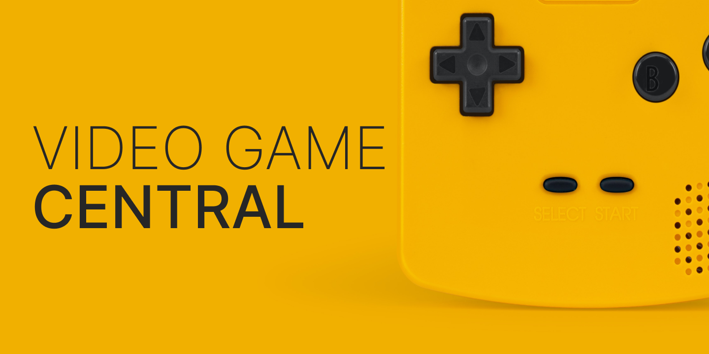

# vg-web

## Intro



[View the live site](https://two-boys-and-a-dream.github.io/vg-web/)

This repo is a web application built with React and bundled with Parcel. It is part of a larger full-stack project to interface with the International Game Data Base (IGDB) API. The site provides video game related information regarding news, new releases, popular titles, and upcoming games.

[See the Back-End repo here](https://github.com/Two-Boys-and-a-Dream/vg-api)

## Requirements

This project requires a basic understanding and working knowledge of the following technologies:

-   [React](https://reactjs.org/)
-   [React Router](https://reactrouter.com/en/main)
-   [React Query](https://react-query-v3.tanstack.com/)
-   [SCSS/SASS](https://sass-lang.com/)
-   [Jest](https://jestjs.io/)
-   [React Testing Library](https://testing-library.com/docs/react-testing-library/intro/)

## Workstation setup

Clone the repo to your machine. Then run:

```
npm i
```

Create a new file in the root project named `.env.development`. Add the following:

```
API_URL = https://vg-api-production.up.railway.app/
```

## Running the project

Start the parcel server with:

```
npm run start
```

A new tab should open in your browser (localhost:1234/)

## Deployments

This project autodeploys to GitHub Pages on each merge to main via GitHub Actions.

[View deployment status](https://github.com/Two-Boys-and-a-Dream/vg-web/deployments/activity_log?environment=github-pages)
